<div align="center">

# Redrob TalentAI Platform

**AI-first enterprise ATS that ranks candidates the way a great recruiter would**

Built for the **Redrob Intelligent Candidate Discovery & Ranking Challenge 2026**


</div>

---

## Demo Video

[Watch Demo Video](docs/Demovideo.mp4)

---

## Architecture

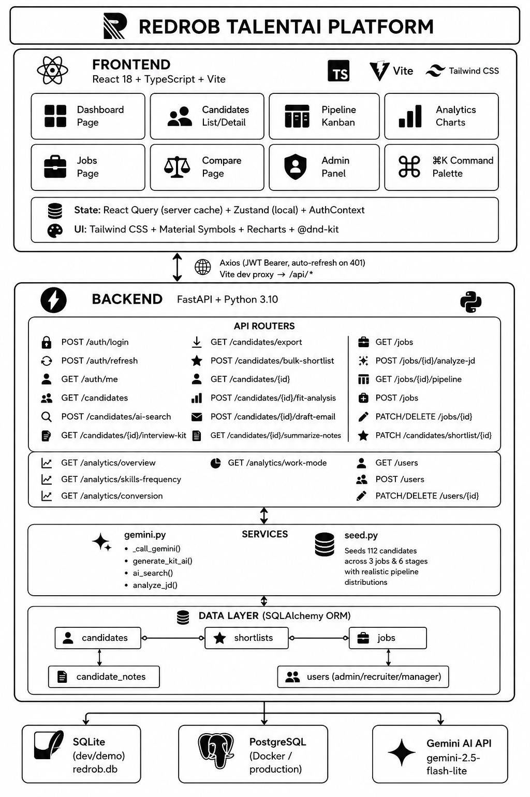

### System Overview

```
  FRONTEND  (React 18 + TypeScript + Vite)
  ┌─────────────────────────────────────────────────────────────────┐
  │  Dashboard  │  Candidates  │  Pipeline  │  Analytics  │  Jobs   │
  │  Compare    │  Admin       │  ⌘K Palette│  Auth       │         │
  │                                                                  │
  │  React Query (server cache) + Zustand + AuthContext             │
  │  Tailwind CSS + Material Symbols + Recharts + @dnd-kit           │
  └──────────────────────────┬──────────────────────────────────────┘
                             │  Axios (JWT Bearer, auto-refresh on 401)
                             ▼
  BACKEND  (FastAPI + Python 3.10)
  ┌─────────────────────────────────────────────────────────────────┐
  │  auth.py │ candidates.py │ jobs.py │ analytics.py │ users.py    │
  │                                                                  │
  │  gemini.py — _call_gemini(), generate_kit_ai(), ai_search(),    │
  │              analyze_jd(), fit_analysis(), draft_email(),       │
  │              summarize_notes()                                   │
  │                                                                  │
  │  SQLAlchemy ORM: candidates ── shortlists ── jobs               │
  │                              candidate_notes ── users           │
  └──────────────────────────┬──────────────────────────────────────┘
                             │
              ┌──────────────┴──────────────┐
              │                             │
       SQLite (dev)              Gemini 2.5 Flash Lite
       PostgreSQL (prod)         (REST API via httpx)
```

---

## AI Scoring Model

Candidates are ranked using a **6-signal weighted model** designed to reflect how expert recruiters evaluate talent:

| Signal | Weight | What it measures |
|---|---|---|
| `skills_match` | **0.28** | Skill depth, proficiency level, duration of use, endorsements |
| `title_role` | **0.22** | Current + historical title alignment with JD patterns |
| `career_trajectory` | **0.18** | Product vs consulting mix, production ML signals, progression |
| `behavioral_signals` | **0.14** | Open-to-work flag, recency, response rate, notice period, GitHub |
| `experience_fit` | **0.13** | Bell-curve years score (peak 7yr) × domain relevance ratio |
| `education_prestige` | **0.05** | Institution tier × degree level × STEM field |

```
final_score = Σ(signal × weight) × behavioral_multiplier × (1 − honeypot_penalty)
```

**Key design decisions from the JD hint:**
- Keyword stuffing is penalized via honeypot detection (expert skill with 0 months duration)
- Behavioral multiplier down-weights candidates inactive >180 days with low response rates
- Consulting-only careers (TCS, Infosys, etc.) receive trajectory penalty
- Non-NLP domains (CV, speech, robotics) are penalized
- Title is weighted 70% current + 30% best historical

---

## Feature Overview

### Gemini AI Workflow Integration
| Feature | Where | What it does |
|---|---|---|
| **Natural Language Search** | Candidates page sidebar | Type plain English — Gemini finds the best matches |
| **JD Analyzer** | Job creation modal | Paste any JD → Gemini extracts skills, seniority, red flags |
| **Fit Analysis** | Shortlist modal | Instant candidate × job fit score with strengths & gaps |
| **Interview Kit** | Candidate detail tab | Personalised questions targeting this candidate's exact profile |
| **Email Drafter** | Candidate detail header | Outreach / invite / rejection / offer emails in one click |
| **Notes Summariser** | Notes tab | Gemini reads all recruiter notes → sentiment, hire signal, action |

### Core Platform
- **Multi-signal AI ranking** with transparent score breakdown
- **Kanban pipeline** with drag-and-drop stage management (DnD Kit)
- **Bulk operations** — select, shortlist to any job, export CSV
- **3-way candidate comparison** with signal bar visualisation
- **Analytics dashboard** — skills frequency, funnel conversion, work mode distribution
- **Role-based access** — Admin / Recruiter / Hiring Manager
- **⌘K Command palette** — global search and keyboard navigation
- **JWT auth** — access tokens (60min) + refresh tokens (7 days), auto-refresh on 401

---

## Screenshots

### Dashboard
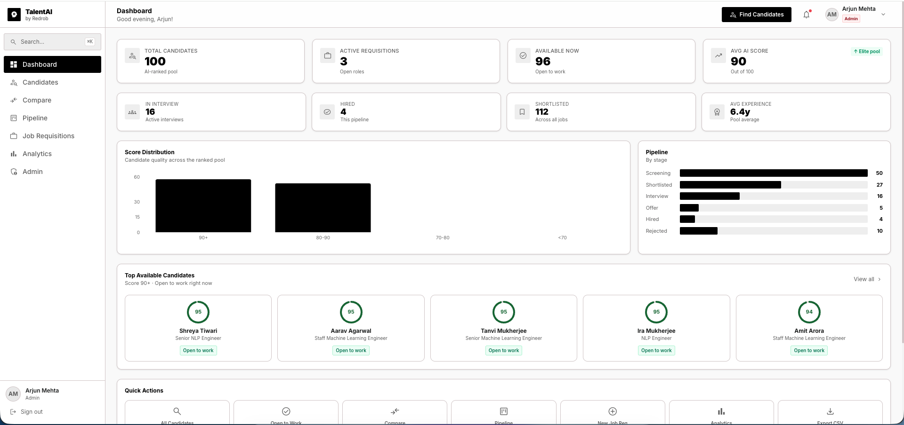

### Candidates List with Gemini AI Search
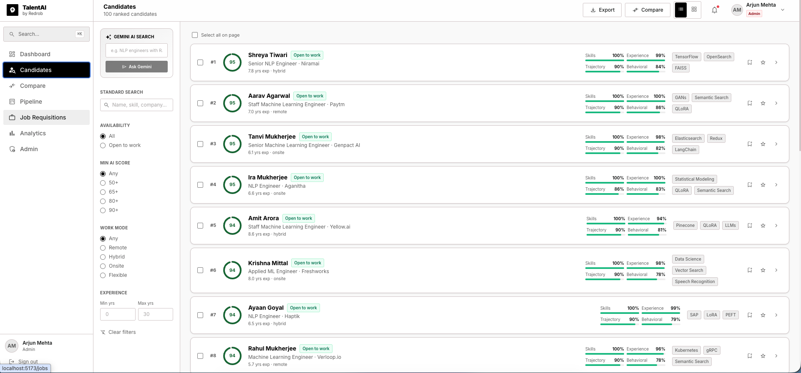

### Candidate Detail — Fit Analysis, Interview Kit, Notes
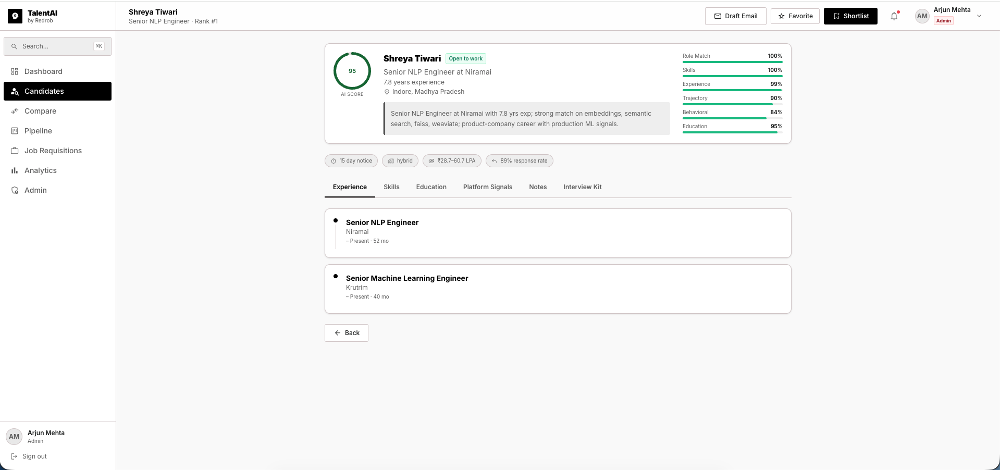

### Gemini Email Drafter
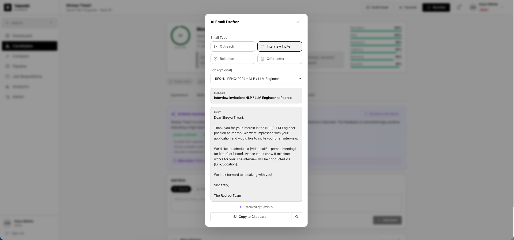

### AI Interview Kit
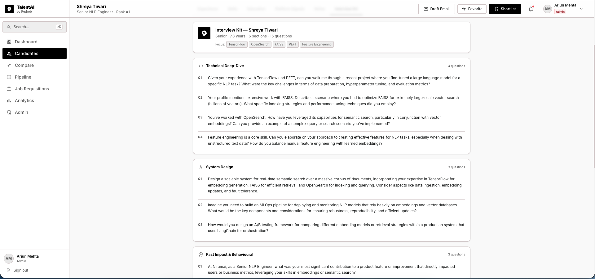

### Notes Tab with AI Summariser
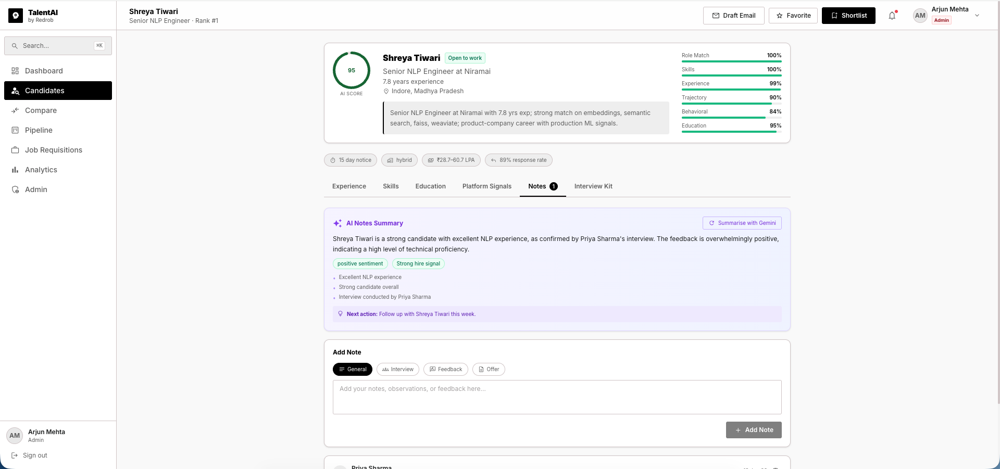

### Hiring Pipeline — Kanban with Drag and Drop
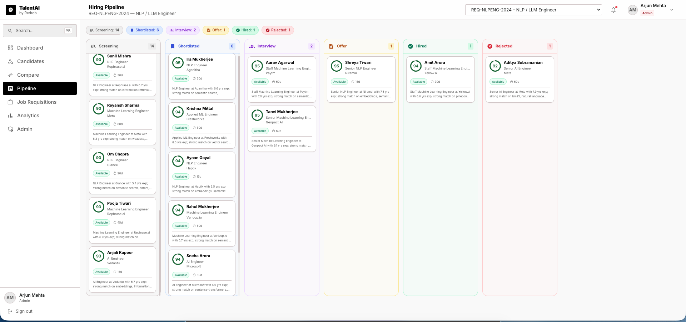

### Job Requisitions with AI JD Analyser
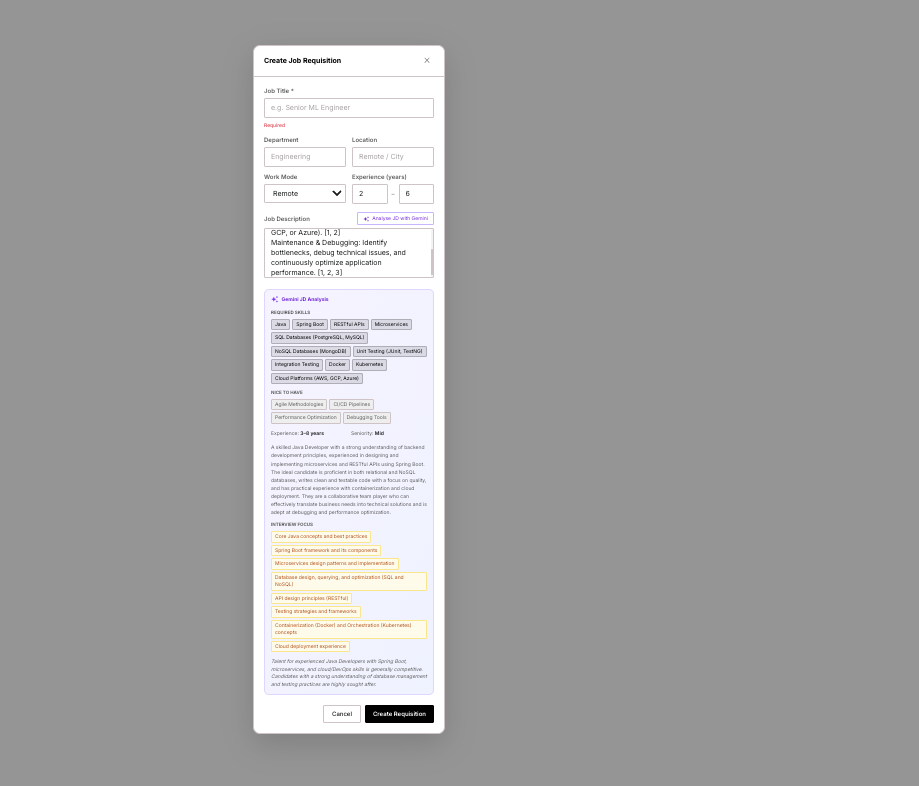

### Analytics Dashboard
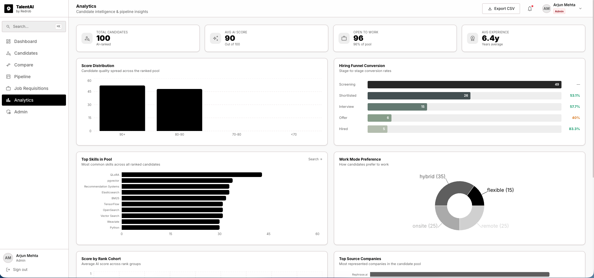

### Candidate Comparison
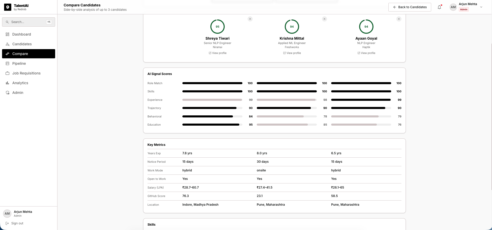

---

## Project Structure

```
redrob_submission/
├── backend/
│   ├── app/
│   │   ├── api/
│   │   │   ├── auth.py          # JWT login, refresh, me, logout
│   │   │   ├── candidates.py    # Full candidate CRUD + all Gemini endpoints
│   │   │   ├── jobs.py          # Job CRUD + pipeline + JD analyzer
│   │   │   ├── analytics.py     # Overview, skills, funnel, work-mode charts
│   │   │   ├── users.py         # Admin user management
│   │   │   └── notes.py         # Interview kit helper (rule-based fallback)
│   │   ├── core/
│   │   │   ├── config.py        # Pydantic settings (reads from .env)
│   │   │   ├── database.py      # SQLAlchemy engine + session
│   │   │   └── security.py      # bcrypt + JWT (direct bcrypt, no passlib)
│   │   ├── models/
│   │   │   ├── candidate.py     # Candidate ORM (score, rank, signals_json, etc.)
│   │   │   ├── job.py           # Job ORM
│   │   │   ├── shortlist.py     # Shortlist ORM (candidate × job × stage)
│   │   │   ├── user.py          # User ORM (role enum)
│   │   │   └── note.py          # CandidateNote ORM
│   │   ├── schemas/             # Pydantic request/response models
│   │   ├── services/
│   │   │   ├── gemini.py        # All Gemini AI calls (env-based key, no hardcoded secrets)
│   │   │   └── seed.py          # Seeds 112 candidates across 3 jobs + pipeline
│   │   ├── deps.py              # get_current_user dependency
│   │   └── main.py              # FastAPI app, CORS, router registration
│   ├── requirements.txt
│   ├── Dockerfile
│   └── .env.example             # Copy to .env and add your keys
│
├── frontend/
│   ├── src/
│   │   ├── pages/
│   │   │   ├── DashboardPage.tsx
│   │   │   ├── CandidatesPage.tsx     # AI search, bulk ops, export
│   │   │   ├── CandidateDetailPage.tsx # All Gemini features
│   │   │   ├── PipelinePage.tsx       # DnD Kanban
│   │   │   ├── JobsPage.tsx           # JD analyzer, delete
│   │   │   ├── AnalyticsPage.tsx      # Recharts dashboards
│   │   │   ├── ComparePage.tsx        # 3-way comparison
│   │   │   ├── AdminPage.tsx          # User CRUD
│   │   │   └── LoginPage.tsx
│   │   ├── components/
│   │   │   ├── Layout/                # AppLayout, Header, Sidebar
│   │   │   └── ui/                    # ScoreRing, SignalBars, Badge, Modal,
│   │   │                              #   CommandPalette, Toast
│   │   ├── contexts/
│   │   │   ├── AuthContext.tsx        # JWT storage, user state
│   │   │   └── ToastContext.tsx       # Global notifications
│   │   ├── lib/
│   │   │   ├── api.ts                 # All Axios calls (auto-refresh)
│   │   │   └── utils.ts
│   │   └── types/index.ts
│   ├── package.json
│   ├── vite.config.ts
│   ├── tailwind.config.js
│   ├── nginx.conf
│   └── Dockerfile
│
├── docs/
│   ├── Demovideo.mp4            # Platform demo video
│   └── screenshots/             # All UI screenshots
│
├── ranked_candidates_submission.csv   # Official 4-column ranked output
├── docker-compose.yml
├── .gitignore
└── README.md
```

---

## Quick Start

### Option A — Local Development (SQLite, zero setup)

**1. Backend**
```bash
cd backend
pip install -r requirements.txt
cp .env.example .env
# Edit .env — add your GEMINI_API_KEY
uvicorn app.main:app --reload --port 8000
```

**2. Frontend**
```bash
cd frontend
npm install
npm run dev
```

Open **http://localhost:5173** — the database seeds automatically on first run.

---

### Option B — Docker (recommended for demo)

```bash
cp backend/.env.example backend/.env
# Edit backend/.env — add GEMINI_API_KEY

docker compose up --build
```

| Service | URL |
|---|---|
| Frontend | http://localhost:80 |
| Backend API | http://localhost:8000/api |
| API Docs | http://localhost:8000/api/docs |

---

## Demo Credentials

| Role | Email | Password |
|---|---|---|
| Admin | admin@redrob.ai | Admin@123 |
| Recruiter | recruiter@redrob.ai | Recruiter@123 |
| Hiring Manager | manager@redrob.ai | Manager@123 |

---

## Environment Variables

Copy `backend/.env.example` to `backend/.env` and fill in:

```env
DATABASE_URL=sqlite:///./redrob.db    # or PostgreSQL URL
SECRET_KEY=your-long-random-secret
GEMINI_API_KEY=your-gemini-api-key    # https://aistudio.google.com/app/apikey
```

> **Note:** All Gemini AI features gracefully fall back to rule-based responses if `GEMINI_API_KEY` is not set. The platform is fully usable without an API key.

---

## Key API Endpoints

### Authentication
| Method | Path | Description |
|---|---|---|
| POST | `/api/auth/login` | Email + password → JWT tokens |
| POST | `/api/auth/refresh` | Refresh token → new access token |
| GET | `/api/auth/me` | Current user profile |

### Candidates
| Method | Path | Description |
|---|---|---|
| GET | `/api/candidates` | List with filters (score, mode, exp, search) |
| GET | `/api/candidates/export` | CSV download (filtered or selected IDs) |
| POST | `/api/candidates/ai-search` | Gemini natural language search |
| POST | `/api/candidates/bulk-shortlist` | Add multiple candidates to a job |
| GET | `/api/candidates/{id}` | Full candidate profile |
| POST | `/api/candidates/{id}/fit-analysis` | Gemini fit score vs a job |
| POST | `/api/candidates/{id}/draft-email` | Gemini email generator |
| GET | `/api/candidates/{id}/summarize-notes` | Gemini notes summary |
| GET | `/api/candidates/{id}/interview-kit` | AI-personalised interview questions |

### Jobs & Pipeline
| Method | Path | Description |
|---|---|---|
| GET | `/api/jobs` | All requisitions with candidate counts |
| POST | `/api/jobs` | Create requisition |
| GET | `/api/jobs/{id}/pipeline` | Kanban data for all stages |
| POST | `/api/jobs/{id}/analyze-jd` | Gemini JD analysis |
| PATCH | `/api/candidates/shortlist/{id}` | Move candidate to new stage |

### Analytics
| Method | Path | Description |
|---|---|---|
| GET | `/api/analytics/overview` | Summary stats |
| GET | `/api/analytics/skills-frequency` | Top skills in talent pool |
| GET | `/api/analytics/conversion` | Pipeline funnel with % rates |
| GET | `/api/analytics/work-mode` | Work mode distribution |

---

## Tech Stack

| Layer | Technology |
|---|---|
| **Frontend framework** | React 18 + TypeScript + Vite |
| **Styling** | Tailwind CSS + Material Symbols |
| **State management** | React Query v5 (server) + React Context (auth/toast) |
| **Drag & Drop** | @dnd-kit/core + @dnd-kit/sortable |
| **Charts** | Recharts |
| **Forms** | React Hook Form |
| **HTTP client** | Axios with JWT interceptor |
| **Backend framework** | FastAPI (Python 3.10) |
| **ORM** | SQLAlchemy 2.0 |
| **Database** | SQLite (dev) · PostgreSQL (prod) |
| **Auth** | JWT (python-jose) + bcrypt (direct, no passlib) |
| **AI** | Google Gemini 2.5 Flash Lite via REST |
| **HTTP client (backend)** | httpx |
| **Containerisation** | Docker + Docker Compose + nginx |

---

## Ranked Candidates Output

The file `ranked_candidates_submission.csv` contains the official submission output:
- **100 candidates** ranked from the 100,000-candidate dataset
- **4 columns:** `candidate_id, rank, score, reasoning`
- Scores are non-increasing (validated against `validate_submission.py`)
- Reasoning strings cite specific evidence from each candidate's profile

**Top 5 ranked candidates:**

| Rank | Candidate | Score | Why |
|---|---|---|---|
| 1 | CAND_0011687 | 0.9545 | Senior NLP Engineer at Niramai, 7.8yr, embeddings + FAISS + Weaviate expert |
| 2 | CAND_0077337 | 0.9541 | Staff ML Engineer at Paytm, 7yr, semantic search + Pinecone production experience |
| 3 | CAND_0046525 | 0.9480 | Senior ML Engineer at Genpact AI, 6.1yr, information retrieval + sentence-transformers |
| 4 | CAND_0052682 | 0.9467 | NLP Engineer at Aganitha, 6.6yr, semantic search + FAISS + LLM production work |
| 5 | CAND_0061932 | 0.9460 | ML Engineer, 7yr, embeddings + Pinecone + RAG production deployment |

---

## Notes

- The platform auto-seeds **112 candidates** across **3 job requisitions** with realistic pipeline distributions on first boot — no manual data import needed.
- All Gemini AI calls have graceful fallbacks — the platform works fully offline / without an API key, with rule-based alternatives.
- FastAPI route ordering is critical: fixed-path routes (`/export`, `/bulk-shortlist`, `/ai-search`) are registered before wildcard routes (`/{candidate_id}`) to prevent 404 misrouting.
- bcrypt is called directly (not via passlib) due to a passlib 1.7.4 incompatibility with bcrypt 5.x.

---

<div align="center">
Built with care for the Redrob AI Challenge 2026
</div>
